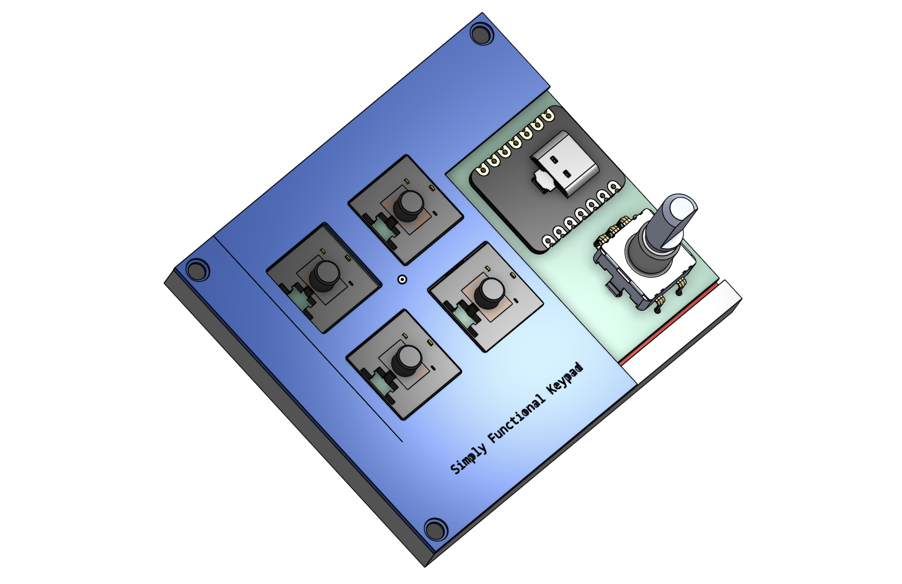
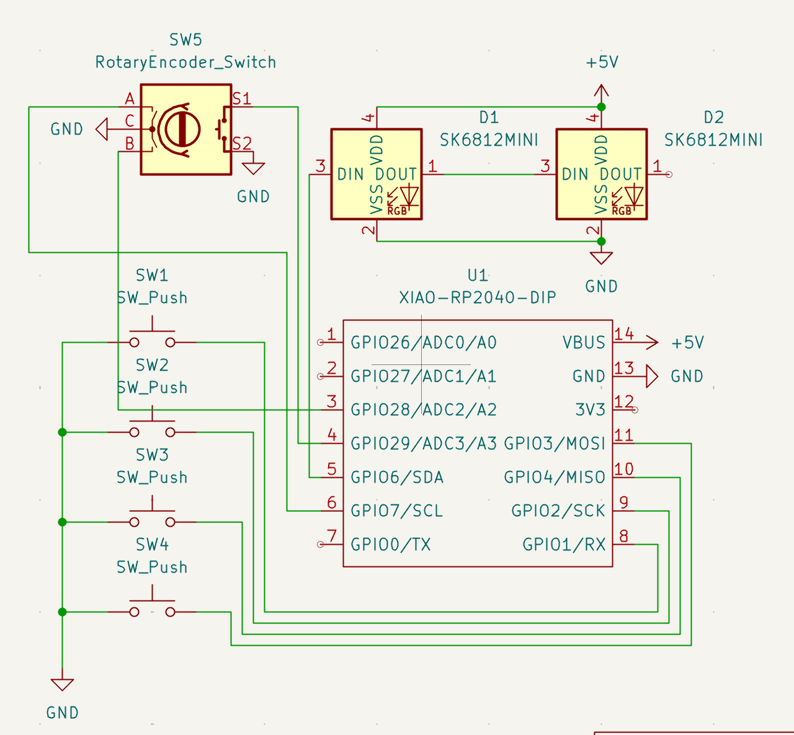

# Simple HackPad
</img>
## PCB
</img>
Here is my PCB, it consists of simple push down switches that can be soldered on

## Schematic
</img>
This schematic is a basic diagram of my keypad, nothing too crazy

## The Legal Case in mind
</img>
This case has room for a SEEED micronctroller, keycaps, and space for extra modifications (OLED display on top for future development)

## BOM
Some parts here are extras within the approved parts lists just in case I mess up
- Seeed XIAO RP2040
- 10 MX-Style Switches
- 10 Blank DSA keycaps
- 10 SK6812 MINI-E LEDs 
- 6 M3x16mm screws
- 6 M3x5mx4mm heatset inserts
- 2 EC11 Rotary encoders 
- 15 Through-hole 1N4148 Diodes
- 1 0.91 inch OLED display (Extra parts so I can play around in the future:)

